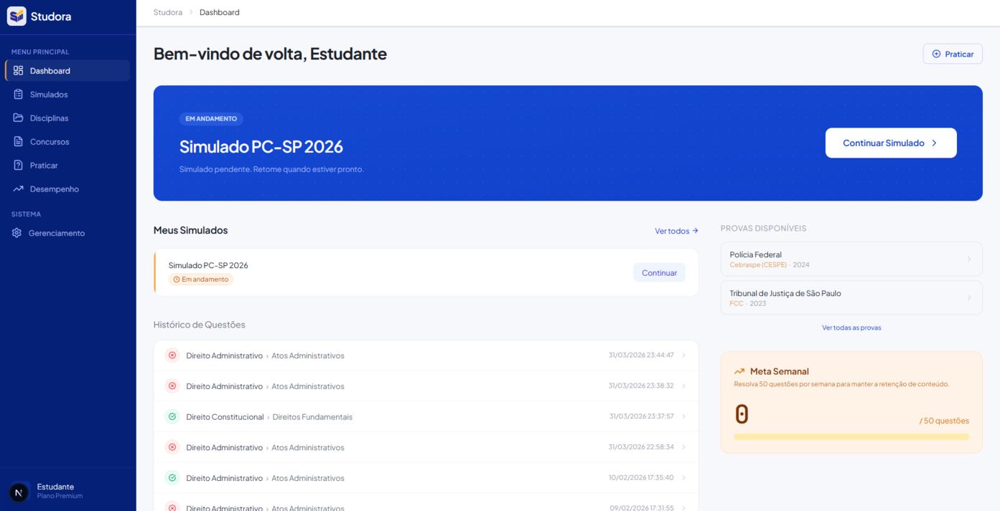

# Studora

> Plataforma de estudos para concursos públicos. Resolução de questões, simulados, mapa do edital e acompanhamento de desempenho.



---

## Stack

| Camada | Tecnologia |
|--------|-----------|
| Framework | Next.js 16 (App Router) |
| Linguagem | TypeScript 5 |
| Estilização | Tailwind CSS 4 |
| Ícones | Lucide React |
| Formulários | React Hook Form + React Select (Async) |
| Gráficos | Recharts |
| Tipografia | Plus Jakarta Sans (UI) · JetBrains Mono (dados) |
| Package Manager | Bun |

---

## Início rápido

```bash
cp .env.example .env   # ajuste NEXT_PUBLIC_API_URL se necessário
bun install
bun dev          # http://localhost:3000
bun build
bun start
```

API backend via `NEXT_PUBLIC_API_URL` (padrão `http://localhost:4534/api/v1`, definido em `src/services/api.ts:7` com fallback).

Repositório do backend: [robsonswe/studora-backend](https://github.com/robsonswe/studora-backend)

### Executando com Docker

```bash
docker compose up --build
# http://localhost:3000
```

Ou sem compose:

```bash
docker build -t studora-front .
docker run --rm -p 3000:3000 studora-front
```

---

## Rotas

### Aluno

| Rota | Descrição |
|------|-----------|
| `/` | Dashboard: simulados recentes, histórico de respostas, meta semanal |
| `/praticar` | Bateria de questões aleatórias filtradas por disciplina, tema, subtema, banca, área e nível |
| `/simulados` | Geração e listagem de simulados por disciplina, tema ou subtema |
| `/simulados/[id]` | Execução do simulado: timer por questão, navegação entre questões, modal de resultado |
| `/provas/executar` | Resolução de prova vinculada a um concurso e cargo específicos |
| `/concursos` | Catálogo de editais com filtros e controle de inscrições por cargo |
| `/concursos/[concursoId]` | Detalhe do concurso |
| `/concursos/[concursoId]/cargos/[cargoId]` | Conteúdo programático do cargo + análise de prontidão |
| `/disciplinas` | Disciplinas com cobertura do edital, taxa de acerto e data de último estudo |
| `/disciplinas/[id]` | Árvore Disciplina → Temas → Subtemas com registro de sessões e estatísticas por tópico |
| `/desempenho` | Consistência diária, evolução temporal, domínio por disciplina, taxa de aprendizado |
| `/perfil` | Perfil do estudante |
| `/configuracoes` | Configurações da aplicação |

### Admin (`/admin`)

| Módulo | Entidade |
|--------|----------|
| `/admin/bancas` | Bancas organizadoras |
| `/admin/instituicoes` | Instituições/órgãos |
| `/admin/cargos` | Cargos (nome, área, nível) |
| `/admin/concursos` | Editais: cargos, datas e conteúdo programático por cargo |
| `/admin/disciplinas` | Disciplinas |
| `/admin/temas` | Temas |
| `/admin/subtemas` | Subtemas |
| `/admin/questoes` | Questões: enunciado, alternativas, gabarito, justificativas, taxonomia |

---

## Componentes principais

### `QuestionCard`
Exige justificativa escrita antes de revelar o gabarito. Após a resposta, exibe acerto/erro, tempo, dificuldade percebida e um insight baseado no comportamento (ex: resposta abaixo de 15s com acerto baixo, chute em questão de nível médio). O slot `postSubmit` é configurável — usado para navegação em simulados ou para carregar a próxima questão avulsa.

### `EditalAnalysisReport`
Analisa os subtemas de um cargo e calcula:
- **Readiness Score** (0–100): cobertura do edital, taxa de acerto e uso do banco de questões
- Alertas por disciplina: cobertura parcial, acerto abaixo de 45%, excesso de chutes, velocidade de resposta baixa, gap entre questões autorais e de concurso real
- Padrões detectados no ciclo: banco subexplorado, desequilíbrio entre teoria e prática, inatividade prolongada
- Recomendações ordenadas por urgência
- Comparativo Autorais vs. Concurso e desempenho segmentado por banca, nível e área do cargo

### `StatsBreakdownPanel`
Exibe acertos/respondidas segmentados por banca, nível, instituição, área e cargo. Suporta highlights para marcar a dimensão relevante ao contexto atual (ex: banca do concurso em exibição).

### `AppShell` / `BreadcrumbContext`
Layout com sidebar responsiva. Detecta automaticamente se a rota é `/admin` e renderiza o painel correspondente. Breadcrumbs definidos por cada página via `PageHeader` e distribuídos via contexto React.

---

## Fluxo de resolução de questão

```
Selecionar alternativa
  → Escrever justificativa (obrigatório)
  → Avaliar dificuldade percebida (Fácil / Média / Difícil / Chute)
  → Confirmar envio
  → Gabarito revelado com justificativas por alternativa
  → Insight de comportamento exibido
  → Próxima questão
```

**Atalhos de teclado** (`/praticar` e `/provas/executar`): `A` `B` `C` `D` `E` selecionam alternativas.

---

## Serviços de API

`src/services/api.ts` — todos os serviços tipados a partir de `src/types/index.ts`:

| Service | Escopo |
|---------|--------|
| `disciplinaService` | Disciplinas, incluindo endpoint `/completo` com temas e subtemas aninhados |
| `temaService` | Temas |
| `subtemaService` | Subtemas e sessões de estudo (CRUD de estudos por subtema) |
| `bancaService` | Bancas |
| `instituicaoService` | Instituições e listagem de áreas |
| `cargoService` | Cargos e listagem de áreas |
| `concursoService` | Concursos e toggle de inscrição por cargo |
| `questaoService` | Questões (CRUD, random, toggle desatualizada) |
| `respostaService` | Respostas do usuário |
| `simuladoService` | Geração, início, finalização e exclusão de simulados |
| `analyticsService` | Consistência diária, domínio por disciplina, evolução semanal, taxa de aprendizado |
| `operationalService` | Health check |

Erros HTTP via `ApiError` com suporte a RFC 7807 (Problem Details) e erros de validação por campo.

---

## Estrutura de arquivos

```
src/
├── app/
│   ├── page.tsx                          # Dashboard
│   ├── praticar/
│   ├── simulados/ & simulados/[id]/
│   ├── provas/executar/
│   ├── concursos/ & concursos/[concursoId]/ & concursos/[concursoId]/cargos/[cargoId]/
│   ├── disciplinas/ & disciplinas/[id]/
│   ├── desempenho/
│   ├── perfil/
│   ├── configuracoes/
│   ├── admin/
│   │   ├── layout.tsx & page.tsx
│   │   ├── bancas/ instituicoes/ cargos/ concursos/
│   │   ├── disciplinas/ temas/ subtemas/ questoes/
│   ├── layout.tsx
│   └── globals.css
├── components/
│   ├── concursos/
│   │   ├── EditalAnalysisReport.tsx
│   │   ├── ConcursoFormModal.tsx
│   │   ├── SubtemaPickerModal.tsx
│   │   ├── SimuladoCargoModal.tsx
│   │   └── CopySubtemasModal.tsx
│   ├── layout/
│   │   ├── AppShell.tsx
│   │   └── BreadcrumbContext.tsx
│   ├── navigation/
│   │   ├── Sidebar.tsx
│   │   ├── Navbar.tsx
│   │   └── AdminSidebar.tsx
│   ├── practice/
│   │   ├── QuestionCard.tsx
│   │   └── strategistInsight.ts
│   └── ui/
│       ├── BaseModal.tsx / FormModal.tsx / Modal.tsx / ConfirmModal.tsx
│       ├── Drawer.tsx / Breadcrumbs.tsx / PageHeader.tsx
│       ├── StatsBreakdownPanel.tsx / QuestaoFormModal.tsx
│       ├── ToastContext.tsx / Feedback.tsx
├── services/
│   └── api.ts                            # NEXT_PUBLIC_API_URL com fallback
├── types/
│   └── index.ts
├── hooks/
│   └── usePageTitle.ts
└── utils/
    ├── formatters.ts
    └── simuladoGenerator.ts
```